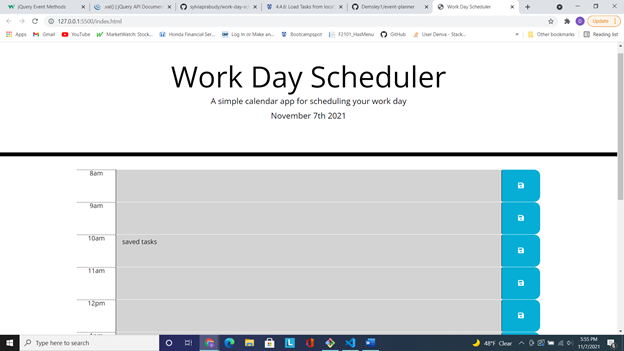
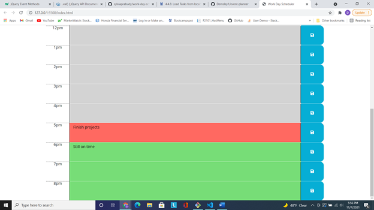

# event-planner

## Description 

Used template daily, Work-Day scehduler, and added improvements to show the current day, and to help users keep track of time by updating the color coded for each time block by wether it is in the past, present, or future of the workday.

## Skills Used

* HTML
* CSS
* JavaScript
* API Libraries: (Jquery, Bootstrap, Moment.js)

## Links

* [Website Link](https://demsley1.github.io/event-planner/)
* [Repo Link](https://github.com/Demsley1/event-planner.git)

## Screenshots of site 

